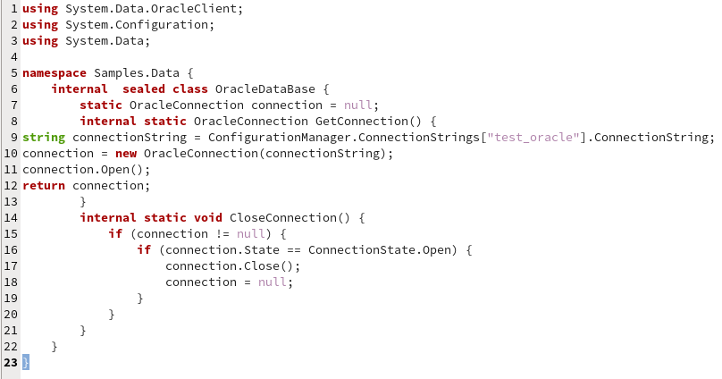
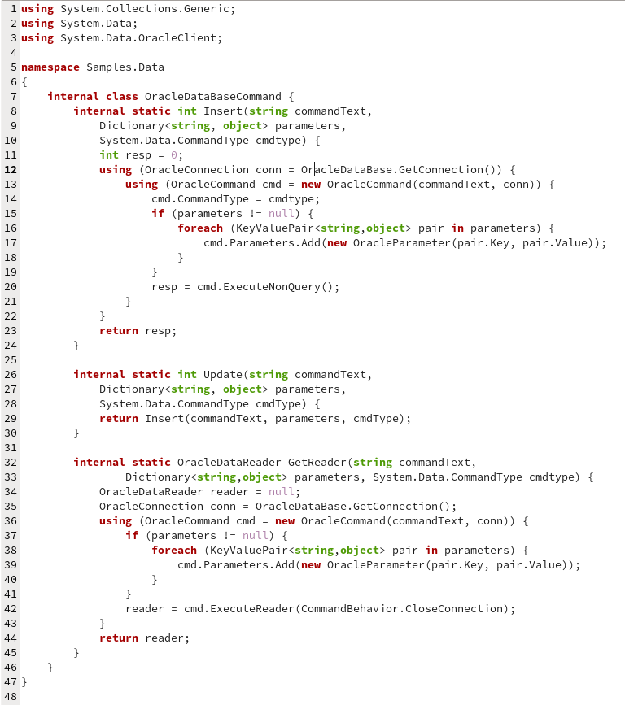
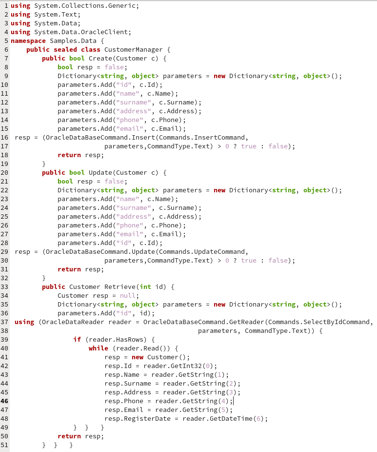
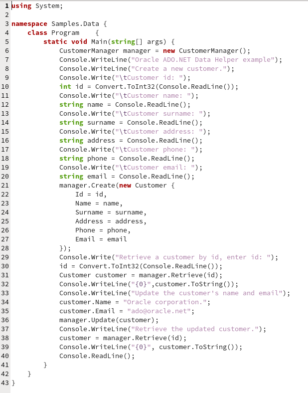

# ADO.NET Helper para Oracle

Hace bastante tiempo que hice unas clases de ADO.NET para Oracle (un tipo helper de manera elemental). quizá no es la manera más optima de acceder a una base de datos, pero al menos en ambientes restringidos en donde no es posible instalar frameworks u otro proveedor de ADO.NET para Oracle que no sea el que viene predeterminado por .NET.

Aquí esta la clase para manejar la conexión, se llama <b>OracleDataBase</b>

<!-- Oracledatabase Class -->

<b>Fig 1. Clase para manejar la conexion a la base de datos.</b>
 

 

Utilizo otra clase llamada <i>OracleDataBaseCommand</i> para auxiliarme con los comandos.

<b>Fig 2. Clase auxiliar para ejecutar los comandos en la base de datos.</b>
 

 

Su utilización dentro de una clase que sirva para persistir o extraer datos sería de la siguiente manera.

<b>Fig 3. Clase que utiliza las clases auxiliares para guardar un objeto.</b>
 

 

<b>Fig 4. Clase principal que crea, actualiza y consulta un cliente en la base de datos.</b>
 

 
